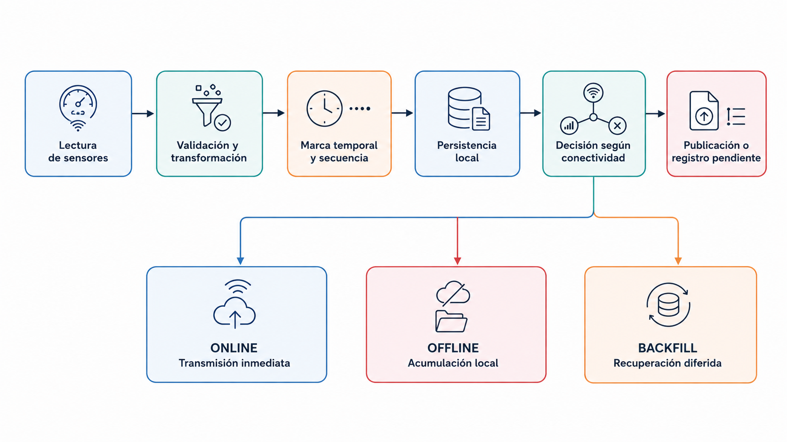
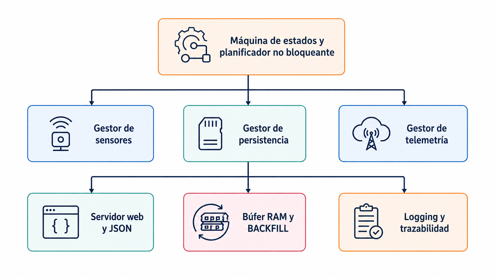
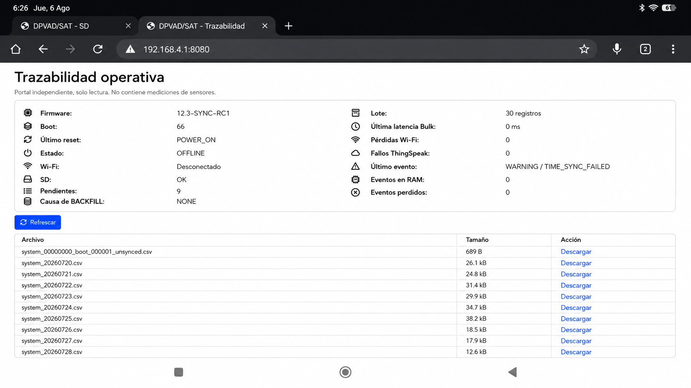
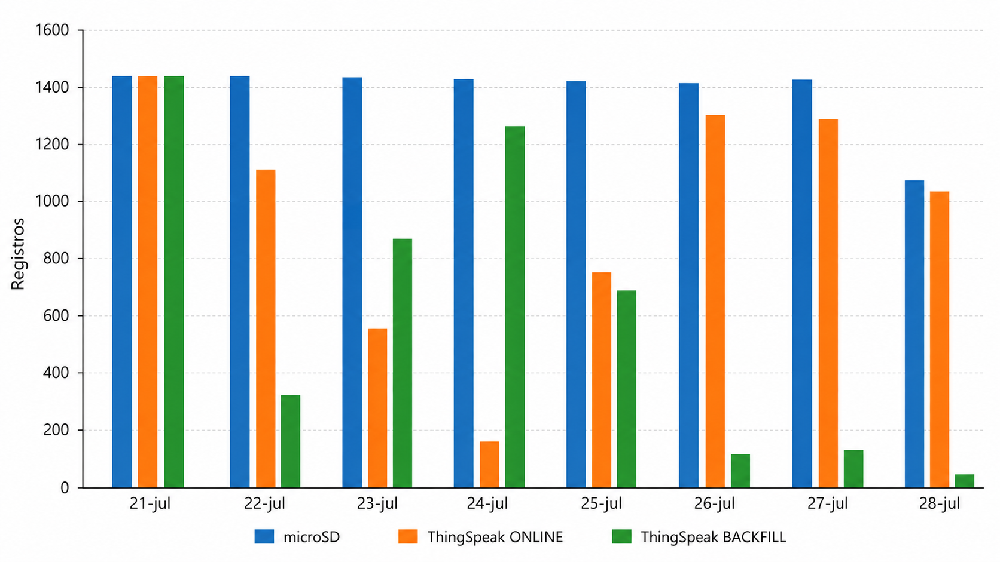
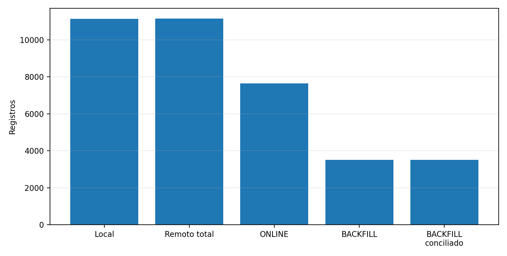

# DPVAD_SAT

**Plataforma de Adquisición de Datos para Sistemas de Alerta Temprana en Contextos con Baja Conectividad**

> Proyecto académico de Ingeniería de Telecomunicaciones — Universidad Nacional Abierta y a Distancia (UNAD).

DPVAD_SAT es una plataforma de adquisición ambiental basada en **ESP32** diseñada para mantener la captura y persistencia de información cuando la conectividad remota es limitada o intermitente. Su arquitectura desacopla adquisición y transmisión mediante operación **ONLINE, OFFLINE y BACKFILL**, persistencia local en microSD y recuperación diferida.


## Objetivo técnico

Integrar sensores heterogéneos, procesamiento en el borde, almacenamiento local, visualización, telemetría y recuperación diferida para reducir la dependencia de disponibilidad inmediata de internet durante la adquisición.

## Alcance

DPVAD_SAT corresponde al componente de **monitoreo y adquisición** asociado a un Sistema de Alerta Temprana. La versión evaluada **no es un SAT institucional completo**: no incorpora modelos predictivos validados, umbrales oficiales, difusión formal de alertas ni protocolos institucionales de respuesta.

## Arquitectura

El ESP32 DevKit V1 actúa como nodo central e integra:

- DHT22 — temperatura y humedad;
- HC-SR04 — distancia/nivel experimental;
- MQ-9 — respuesta relativa a gases combustibles;
- MPU-9250 — variables inerciales;
- BMP/BME280 — presión, temperatura y altitud estimada;
- LCD 20 × 4;
- microSD;
- Wi‑Fi;
- ThingSpeak;
- servicios HTTP locales.



### Firmware



La máquina de estados coordina sensores, persistencia, telemetría, web/JSON, contingencia RAM/BACKFILL y logging.

### Modos de operación

- **ONLINE:** adquisición, persistencia y publicación remota.
- **OFFLINE:** adquisición y persistencia continúan sin publicación inmediata.
- **BACKFILL:** recuperación diferida de registros pendientes.


## Servicios locales

**Puerto 80 — portal de datos:** consulta y descarga de CSV almacenados en microSD.


**Puerto 8080 — trazabilidad operativa:** versión de firmware, conectividad, pendientes, lotes, eventos y logs.



## ThingSpeak y MATLAB

ThingSpeak fue utilizado como plataforma remota de recepción y visualización. MATLAB se utilizó como tecnología complementaria para análisis y representación de datos.


### Mapeo remoto

| Campo | Variable | ONLINE | BACKFILL |
|---|---|---:|---:|
| `field1` | Distancia | Sí | Sí |
| `field2` | Temperatura | Sí | Sí |
| `field3` | Humedad | Sí | Sí |
| `field4` | MQ-9 / `gas_ppm` estimado | Sí | Sí |
| `field5` | Presión | Sí | Sí |
| `field6` | Altitud estimada | Sí | Sí |
| `field7` | Información temporal | Sí | No |
| `field8` | Estado operativo | Sí | No |

## Validación experimental

Ventana formal: **21–28 de julio de 2026 (UTC−5)**.

Fuentes:
1. microSD;
2. ThingSpeak;
3. logs del firmware.



## Resultados principales

| Indicador | Resultado |
|---|---:|
| Registros locales | **11.135** |
| Registros nominales | **11.160** |
| Completitud temporal local | **99,776 %** |
| Publicaciones remotas | **11.148** |
| ONLINE | **7.641 (68,54 %)** |
| BACKFILL | **3.507 (31,46 %)** |
| BACKFILL conciliado | **3.507/3.507** |
| Completitud BACKFILL operativa | **100 % (6/6)** |
| Completitud integral BACKFILL | **75 % (6/8)** |
| Duplicados físicos exactos | **0** |
| Lotes exitosos | **249** |
| Intentos fallidos | **139** |
| Cola pendiente máxima | **1.479** |
| Intervalos exactamente de 60 s | **96,486 %** |
| Intervalos >90 s | **18** |
| Intervalo máximo | **157 s** |



### Fidelidad BACKFILL

Las 3.507 publicaciones BACKFILL pudieron conciliarse con combinaciones locales únicas de `field1`–`field6`. A la resolución de dos decimales usada en la comparación, el error absoluto y porcentual observado fue cero. Esto evalúa fidelidad de transmisión, **no exactitud metrológica**.

### Limitaciones

- Wi‑Fi evaluado en entorno controlado.
- Sin latencia extremo a extremo por falta de timestamps comparables.
- Sin clave individual común para conciliar toda la serie ONLINE.
- BACKFILL omite `field7` y `field8`.
- Sin instrumentos patrón certificados para todas las variables.
- `field4` presentó ausencias ONLINE que no tienen una única explicación demostrable.

## Contenido del repositorio

```text
docs/          arquitectura, metodología, resultados, limitaciones y figuras
firmware/      fuente preliminar sanitizada y parámetros
data/raw/      registros microSD y logs operativos originales
data/derived/  tablas derivadas de la V6
thingspeak/    mapeo y resultados de telemetría
matlab/        alcance del análisis MATLAB
analysis/      guía de análisis
contact/       contacto académico
```

## Derechos de uso

**Copyright © 2026 Rodrigo Salazar Valencia. Todos los derechos reservados.**

El repositorio es público para consulta y reproducibilidad académica, pero no concede una licencia abierta de reutilización. Consulte [RIGHTS.md](RIGHTS.md).

Contacto: **rsalazarv@unadvirtual.edu.co**
