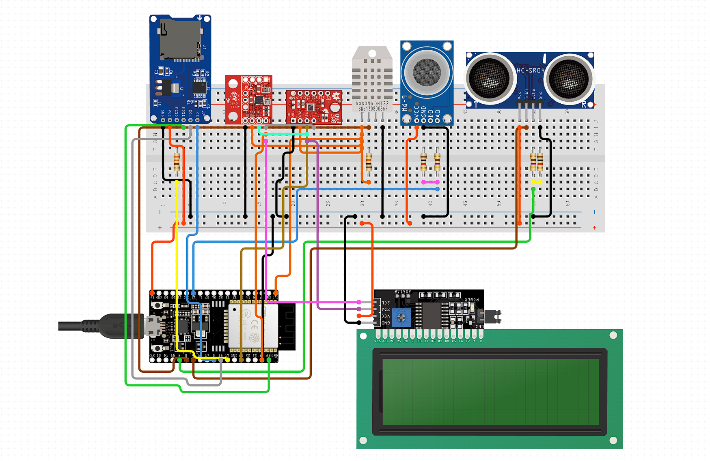
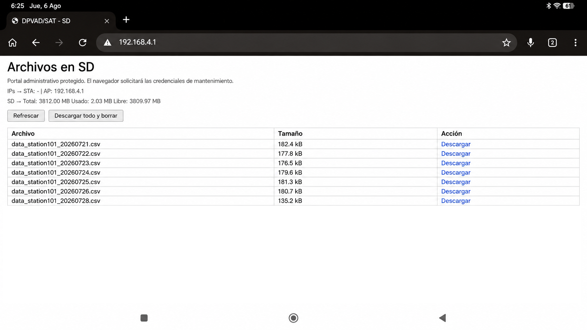
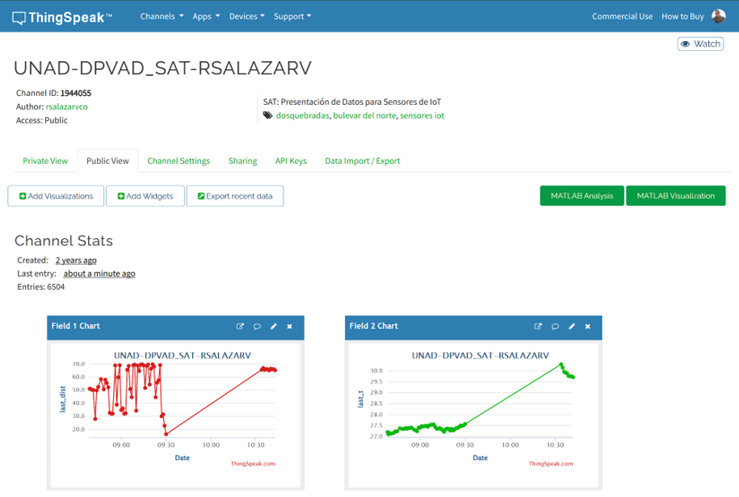
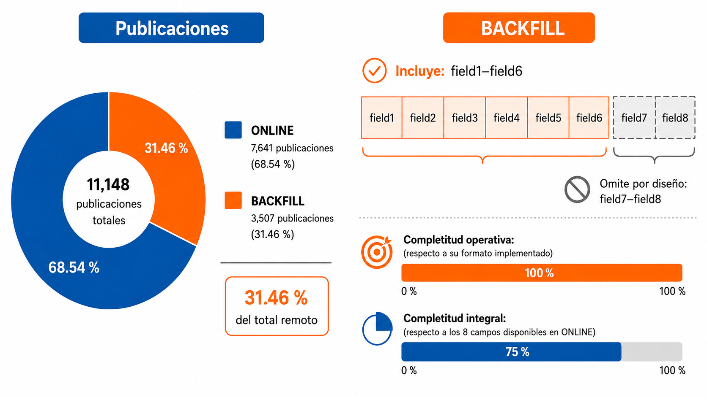

# DPVAD_SAT

**Plataforma de Adquisición de Datos para Sistemas de Alerta Temprana en Contextos con Baja Conectividad**

DPVAD_SAT es una plataforma académica basada en ESP32 para adquisición, persistencia local, visualización y transmisión de datos ambientales bajo conectividad intermitente. La solución desacopla la adquisición de la disponibilidad inmediata de internet mediante operación **ONLINE, OFFLINE y BACKFILL**.

## Alcance

El prototipo se ubica en el componente de **monitoreo y detección** asociado a un SAT. No implementa un SAT completo: no incorpora modelos predictivos validados, umbrales institucionales certificados, difusión formal de alertas ni procedimientos de respuesta.

## Arquitectura

Nodo central: **ESP32 DevKit V1**.

Sensores y periféricos:
- DHT22: temperatura y humedad.
- HC-SR04: distancia/nivel experimental.
- MQ-9: respuesta relativa a gases combustibles.
- MPU-9250: variables inerciales.
- BMP/BME280: presión, temperatura y altitud estimada.
- LCD 20 × 4.
- microSD.
- Wi‑Fi y servicios HTTP.

## Operación offline-first

- **ONLINE:** adquisición local + publicación remota.
- **OFFLINE:** la adquisición y persistencia continúan sin publicación inmediata.
- **BACKFILL:** los registros pendientes se recuperan por lotes cuando retorna la conectividad.

## Servicios locales

- **Puerto 80:** consulta y descarga de registros almacenados en microSD.
- **Puerto 8080:** administración y trazabilidad operativa de solo lectura.

## ThingSpeak y MATLAB

ThingSpeak fue utilizado como plataforma remota de recepción y visualización de telemetría. MATLAB se utilizó como tecnología complementaria para análisis y representación de datos.

Mapeo ONLINE documentado:
`field1` distancia, `field2` temperatura, `field3` humedad, `field4` MQ-9, `field5` presión, `field6` altitud, `field7` fecha/hora local y `field8` estado.

BACKFILL transmite `field1`–`field6`.

## Datos disponibles en este paquete

Se incluyen:
- registros locales originales de microSD;
- logs operativos originales;
- tablas derivadas de los resultados V6;
- firmware preliminar sanitizado;
- las 34 figuras del documento V6.

La exportación original `feeds_thingspeak.csv` está identificada en la tesis como fuente primaria, pero no se reconstruye artificialmente si no está disponible.

## Resultados principales

- **11.135** registros locales de **11.160** nominales: **99,776 %**.
- **11.148** publicaciones remotas.
- **7.641 ONLINE**.
- **3.507 BACKFILL** (**31,46 %** de la telemetría remota).
- BACKFILL: **100 %** respecto de los seis campos implementados y **75 %** frente a los ocho campos ONLINE.
- **0 duplicados físicos exactos** bajo los criterios evaluados.
- **249** lotes BACKFILL exitosos y **139** intentos fallidos.
- **96,486 %** de los intervalos intradía fueron exactamente de 60 s.

## Firmware

`firmware/source/DPVAD_SAT_v12_5_SYNC_RC1_1_PUBLIC.ino` es una versión **preliminar sanitizada**. Las credenciales originales fueron sustituidas antes de su inclusión.

## Derechos de uso

**Copyright © 2026 Rodrigo Salazar Valencia. Todos los derechos reservados.**

Este repositorio es público para consulta, evaluación y reproducibilidad académica, pero **no concede una licencia abierta de reutilización**. Consulte [RIGHTS.md](RIGHTS.md).

Contacto: **rsalazarv@unadvirtual.edu.co**

## Documento base

La organización técnica de este repositorio fue contrastada con la versión V6 del proyecto de grado de Ingeniería de Telecomunicaciones, Universidad Nacional Abierta y a Distancia — UNAD.
